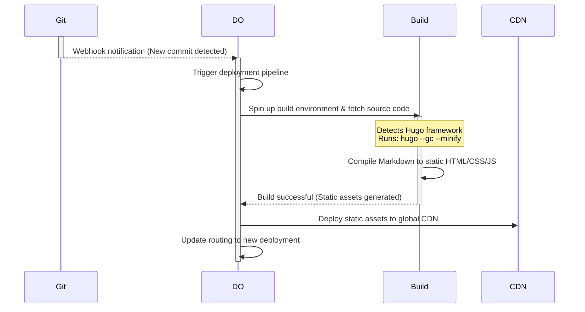

# About

This is a [hugo](https://gohugo.io/) app for [www.zachcalvert.com](https://www.zachcalvert.com) deployed on [Digital Ocean](https://www.digitalocean.com/)'s CDN.  

# CI/CD Workflow

```mermaid
sequenceDiagram
activate Git
    Git-->>DO: Webhook notification (New commit detected)
    deactivate Git

    activate DO
    DO->>DO: Trigger deployment pipeline
    DO->>Build: Spin up build environment & fetch source code
    activate Build
    
    Note over Build: Detects Hugo framework<br/>Runs: hugo --gc --minify
    
    Build->>Build: Compile Markdown to static HTML/CSS/JS
    Build-->>DO: Build successful (Static assets generated)
    deactivate Build

    DO->>CDN: Deploy static assets to global CDN
    DO->>DO: Update routing to new deployment
     deactivate DO
```
